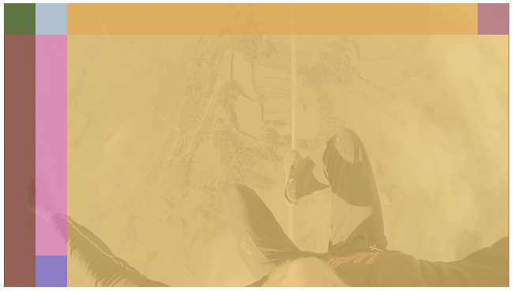

<!-- [](https://www.jsdelivr.com/package/npm/clappr-context-menu-plugin) -->
<!-- [](https://npmjs.org/package/clappr-context-menu-plugin) -->
<!-- [](https://npmjs.org/package/clappr-context-menu-plugin) -->
<!-- [](https://bundlephobia.com/result?p=clappr-context-menu-plugin) -->
[](http://makeapullrequest.com)


[](https://github.com/joaopaulovieira/clappr-media-control-plugin/blob/master/LICENSE)

# Clappr Media Control plugin

<div align=center>
  
</div>
<br>

<!-- ## Demo -->

## Examples
<details open>
  <summary>Example 1:</summary>
  <ul>
    <br>
    <details style= 'margin-left: 20px;'>
      <summary>Configs:</summary>
      <br>
      
      
    </details>
    <details style= 'margin-left: 20px;'>
      <summary>DOM tree:</summary>
      <br>
      
    </details>
    <details open style= 'margin-left: 20px;'>
      <summary>UI:</summary>
      <br>
      
    </details>
  </ul>
</details>
<br>
<details>
  <summary>Example 2:</summary>
  <ul>
    <br>
    <details style= 'margin-left: 20px;'>
      <summary>Configs:</summary>
      <br>
      
      
    </details>
    <details style= 'margin-left: 20px;'>
      <summary>DOM tree:</summary>
      <br>
      
    </details>
    <details open style= 'margin-left: 20px;'>
      <summary>UI:</summary>
      <br>
      
    </details>
  </ul>
</details>
<br>
<details>
  <summary>Example 3:</summary>
  <ul>
    <br>
    <details style= 'margin-left: 20px;'>
      <summary>Configs:</summary>
      <br>
      
      
    </details>
    <details style= 'margin-left: 20px;'>
      <summary>DOM tree:</summary>
      <br>
      
    </details>
    <details open style= 'margin-left: 20px;'>
      <summary>UI:</summary>
      <br>
      
    </details>
  </ul>
</details>
<br>
<details>
  <summary>Example 4:</summary>
  <ul>
    <br>
    <details style= 'margin-left: 20px;'>
      <summary>Configs:</summary>
      <br>
      
      
    </details>
    <details style= 'margin-left: 20px;'>
      <summary>DOM tree:</summary>
      <br>
      
    </details>
    <details open style= 'margin-left: 20px;'>
      <summary>UI:</summary>
      <br>
      
    </details>
  </ul>
</details>
<br>

<!-- ## Table of Contents
- [Features](https://github.com/joaopaulovieira/clappr-skeleton-plugin#Features)
- [Usage](https://github.com/joaopaulovieira/clappr-skeleton-plugin#Usage)
- [Configuration](https://github.com/joaopaulovieira/clappr-skeleton-plugin#Configuration)
- [Development](https://github.com/joaopaulovieira/clappr-skeleton-plugin#Development)

## Features
- Enumerate features;

## Usage
You can use it from JSDelivr:
```
https://cdn.jsdelivr.net/npm/clappr-skeleton-plugin@latest/dist/clappr-skeleton-plugin.min.js
```
or as an npm package:
```
yarn add clappr-skeleton-plugin
```
Then just add `SkeletonPlugin` into the list of plugins of your player instance
```javascript
var player = new Clappr.Player({
  source: 'http://your.video/here.mp4',
  plugins: [SkeletonPlugin]
});
```

## Configuration
The options for the plugin go in the `SkeletonOptions` property as shown below
```javascript
var player = new Clappr.Player({
  source: 'http://your.video/here.mp4',
  plugins: [SkeletonPlugin],
  // add example of plugin options usage
  SkeletonOptions: {}
});
```

### `OptionName {OptionType}`
Description of the option


## Development

Install dependencies: `yarn`

Run: `yarn start`

Build: `yarn build`

Minified version: `yarn release` -->
