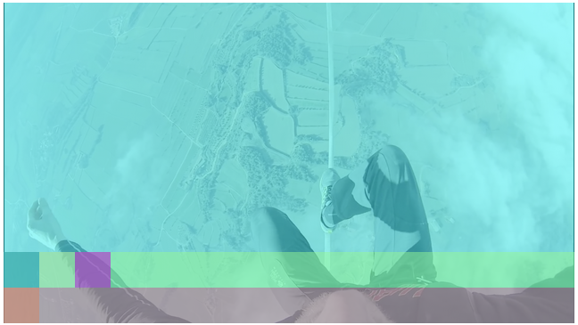

[](https://npmjs.org/package/@joaopaulo.vieira/clappr-media-control-plugin)
[](https://npmjs.org/package/@joaopaulo.vieira/clappr-media-control-plugin)
[](https://npmjs.org/package/@joaopaulo.vieira/clappr-media-control-plugin)
[](https://bundlephobia.com/result?p=@joaopaulo.vieira/clappr-media-control-plugin)
[](https://github.com/joaopaulovieira/clappr-media-control-plugin/commits/main)
[](http://makeapullrequest.com)


[](https://github.com/joaopaulovieira/clappr-media-control-plugin/blob/master/LICENSE)

# Clappr Media Control plugin

<div align=center>
  
</div>
<br>

## Demo
https://joaopaulovieira.github.io/clappr-media-control-plugin/

## Features
### :sparkles: Simple structure
With a structure with few abstractions (layers, sections, and elements), understanding how to build a media control is easier and helps to achieve the wanted experience in the video consumption.

### :iphone:/:computer:/:desktop_computer: Responsive by default
Using `flexbox`, all components are positioned to ensure the best use in a wide range of video consumption environments.

### :electric_plug: Add more components using Clappr plugin architecture
The architecture of the media control was built to facilitate the addition of new elements in the interface via plugins of the category `MediaControlComponents`, following the extensibility mindset of Clappr. (More info about `MediaControlComponents` [here](https://github.com/joaopaulovieira/clappr-media-control-plugin#media-control-components).)

### :toolbox: Highly customizable
It's possible to configure from the number of layers/sections, to how the sections within a specific layer (or an element within a specific section) should be positioned! With this level of customization, it is possible to create an infinite range of interfaces. See examples of interfaces [here](https://github.com/joaopaulovieira/clappr-media-control-plugin#Examples).

### :clapper: Minimal configuration for standard use
Don't want to customize anything to have a functional media control? Just load the media control plugin and the main components and that's it! You will have a media control just like the gif of illustration.

## Structure
Thinking of a minimalist architecture that needs to supports a high degree of customization, the entire structure of media control is summarized with three concepts: `Layers`, `Sections`, and `Elements` (`MediaControlComponents`).

### Layers
One layer holds all the space available in the Clappr core element, making this entire area available to be subdivided into sections. A layer can also have only one section. 

### Sections
Represents a portion of a layer. Sections can be varied in size and be oriented on the X or Y axis of a layer. Sections are also the area where media control elements are to be rendered.

### Elements (`MediaControlComponents`)
They are Clappr core plugins that extend from a base class created to standardize the creation of components for media control. These elements can only be rendered within a section.

## Media Control Components
This base class has getters and behaviors that were designed to facilitate the configuration and creation of components for the media control.

There are getters that must be overwritten for the correct component configuration. It's them:

### MediaControlComponentPlugin.layer
It must return the id of the layer to which the section that the plugin has to be rendered belongs.

### MediaControlComponentPlugin.section
It must return the id of the section that the plugin has to be rendered.

### MediaControlComponentPlugin.position
It should return the id of the position that the plugin has to be rendered within the wanted section. In horizontal sections, the order of position will be from left to right and in vertical sections, the order will be from top to bottom.

There are getters that can be overwritten but are not mandatory. It's them:

### MediaControlComponentPlugin.separator
Returns `false` by default. If it's overwritten to return the value `true`, it will cause the plugin to be rendered at the opposite point from the starting position and causing all rendered plugins after it to follow the same rendering order.

You can see all `MediaControlComponentPlugin` code [here](https://github.com/joaopaulovieira/clappr-media-control-plugin/blob/main/src/base/media_control_component/media_control_component.js).

## Usage
Before starting the plugin, you need to get it. The two most used ways of doing this are:

Loading as an external script from any npm.js public CDN (like JSDelivr):
```
https://cdn.jsdelivr.net/npm/@joaopaulo.vieira/clappr-media-control-plugin@latest/dist/clappr-media-control-plugin.min.js
```
or as an npm package:
```properties
# Using yarn
yarn add @joaopaulo.vieira/clappr-media-control-plugin

# Using npm
npm i @joaopaulo.vieira/clappr-media-control-plugin
```

Then just add `MainPlugin` and the other media control components into the list of plugins of your player instance:
```javascript
var player = new Clappr.Player({
  source: 'http://your.video/here.mp4',
  plugins: [
    MediaControl.MainPlugin,
    MediaControl.PlayPauseButtonPlugin,
    MediaControl.VolumePlugin,
    MediaControl.FullscreenButtonPlugin,
    MediaControl.SeekBarPlugin,
    MediaControl.TimeIndicatorPlugin,
    ]
});
```

***In this project, the order of loading plugins in Clappr does not matter as both `MediaControlPlugin` and` MediaControlComponentPlugin` have mechanisms to guarantee the rendering of all elements.***

## Configuration

***For specific component configs, check [this table](https://github.com/joaopaulovieira/clappr-media-control-plugin/tree/main/src/components).***

The options for the plugin go in the `mediaControl` property as shown below:
```javascript
var player = new Clappr.Player({
  source: 'http://your.video/here.mp4',
  plugins: [MediaControl.MainPlugin],
  mediaControl: {
    disableBeforeVideoStarts: false,
    layersQuantity: 1,
    layersConfig: [
      {
        id: 1,
        sectionsQuantity: 1,
        flexDirection: 'column',
        sectionsConfig: [
          {
            id: 1,
            separator: true,
            height: '100%',
            width: '100%',
            alignItems: 'stretch',
            justifyContent: 'flex-start',
            flexGrow: 0,
          }
        ]
      }
    ]
  }
});
```

### `disableBeforeVideoStarts {Boolean}`
Sets whether the media control is visible before the media even starts to play.

### `layersQuantity {Integer}`
Defines the number of layers that will be created in the media control.

### `layersConfig {Array}`
An array where each item is an object representing one layer config. One layer config item can have `id`, `sectionsQuantity`, `flexDirection` and `sectionsConfig` attributes.

### `layersConfig[n].id {Integer}`
Identifies the layer that will use the configs belonging to the same scope as this config.

### `layersConfig[n].sectionsQuantity {Integer}`
Defines the number of sections that will be created in the selected layer via the attribute `id`.

### `layersConfig[n].flexDirection {String}`
Defines the orientation of the sections created within a layer. It uses the [flex-direction](https://developer.mozilla.org/en-US/docs/Web/CSS/flex-direction) property as a basis, and can only receive the same values that this property supports.

### `layersConfig[n].sectionsConfig {Array}`
An array where each item is an object representing one section config. One section config item can have `id`, `separator`, `height`, `width`, `alignItems`, `justifyContent` and `flexGrow` attributes.

### `layersConfig[n].sectionsConfig[n].id {Integer}`
Identifies the section that will use the configs belonging to the same scope as this config.

### `layersConfig[n].sectionsConfig[n].separator {Integer}`
Sets the configured section to be positioned at the opposite end of the starting position of a section.

### `layersConfig[n].sectionsConfig[n].height {String}`
Specifies the height of the selected section. It uses the [height](https://developer.mozilla.org/en-US/docs/Web/CSS/height) property as a basis, and can only receive the same values that this property supports.

### `layersConfig[n].sectionsConfig[n].width {String}`
Sets the width of the selected section. It uses the [width](https://developer.mozilla.org/en-US/docs/Web/CSS/width) property as a basis, and can only receive the same values that this property supports.

### `layersConfig[n].sectionsConfig[n].alignItems {String}`
Align elements on the cross axis inside of the selected section. It uses the [align-items](https://developer.mozilla.org/en-US/docs/Web/CSS/align-items) property as a basis, and can only receive the same values that this property supports.

### `layersConfig[n].sectionsConfig[n].justifyContent {String}`
Align elements along the main axis inside of the selected section. It uses the [justify-content](https://developer.mozilla.org/en-US/docs/Web/CSS/justify-content) property as a basis, and can only receive the same values that this property supports.

### `layersConfig[n].sectionsConfig[n].flexGrow {Integer}`
Defines the growth factor of the selected section inside one layer. It uses the [flex-grow](https://developer.mozilla.org/en-US/docs/Web/CSS/flex-grow) property as a basis, and can only receive the same values that this property supports.

## Examples
<details open>
  <summary>Example 1:</summary>
  <ul>
    <br>
    <details style= 'margin-left: 20px;'>
      <summary>Configs:</summary>
      <br>
      
      
    </details>
    <details style= 'margin-left: 20px;'>
      <summary>DOM tree:</summary>
      <br>
      
    </details>
    <details open style= 'margin-left: 20px;'>
      <summary>UI:</summary>
      <br>
      
    </details>
  </ul>
</details>
<br>
<details>
  <summary>Example 2:</summary>
  <ul>
    <br>
    <details style= 'margin-left: 20px;'>
      <summary>Configs:</summary>
      <br>
      
      
    </details>
    <details style= 'margin-left: 20px;'>
      <summary>DOM tree:</summary>
      <br>
      
    </details>
    <details open style= 'margin-left: 20px;'>
      <summary>UI:</summary>
      <br>
      
    </details>
  </ul>
</details>
<br>
<details>
  <summary>Example 3:</summary>
  <ul>
    <br>
    <details style= 'margin-left: 20px;'>
      <summary>Configs:</summary>
      <br>
      
      
    </details>
    <details style= 'margin-left: 20px;'>
      <summary>DOM tree:</summary>
      <br>
      
    </details>
    <details open style= 'margin-left: 20px;'>
      <summary>UI:</summary>
      <br>
      
    </details>
  </ul>
</details>
<br>
<details>
  <summary>Example 4:</summary>
  <ul>
    <br>
    <details style= 'margin-left: 20px;'>
      <summary>Configs:</summary>
      <br>
      
      
    </details>
    <details style= 'margin-left: 20px;'>
      <summary>DOM tree:</summary>
      <br>
      
    </details>
    <details open style= 'margin-left: 20px;'>
      <summary>UI:</summary>
      <br>
      
    </details>
  </ul>
</details>
<br>

## Advanced Usage
It is also possible to import only the structure of the media control without any default components, giving you the possibility to create all the components of a media control the way you want and avoiding importing unnecessary code for your purposes!

For this, there is a bundle that has only the main media control plugin and the base class for creating components. You can download directly via a public CDN that exposes npm.js packages:
```
https://cdn.jsdelivr.net/npm/@joaopaulo.vieira/clappr-media-control-plugin@latest/dist/light-clappr-media-control-plugin.min.js
```

Or install via npm package:
```properties
# Using yarn
yarn add @joaopaulo.vieira/clappr-media-control-plugin

# Using npm
npm i @joaopaulo.vieira/clappr-media-control-plugin
```

and when importing, use the path that leads directly to this bundle:
```javascript
import { MainPlugin, BaseComponentPlugin } from '@joaopaulo.vieira/clappr-media-control-plugin/dist/light-clappr-media-control-plugin'
```

## Development
Install dependencies: `npm install`

Run: `npm start`

Test: `npm test`

Lint: `npm run lint`

Build: `npm run build`

Minified version: `npm run release`
